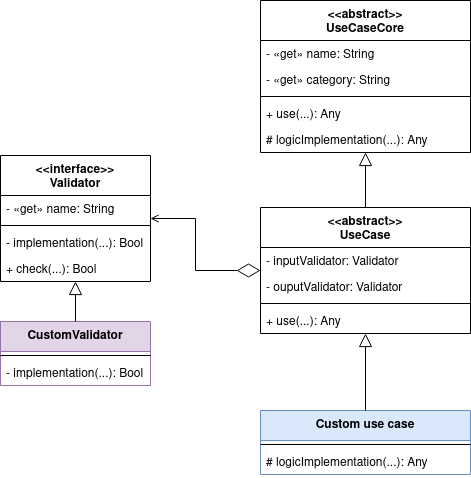

Implementation of the application business rules (use cases) layer in
the clean architecture for backend applications (bisslog)
================

It is to create functionalities in the backend, without dependencies and
based on use cases. Minimize the cost of a possible migration to another
web framework.

## Motivation

Backend web frameworks, which are responsible for receiving requests at
an endpoint and then returning the response, bring with them benefits
that can facilitate software development, encompassing most of the
layers described in the clean architecture \[1\]. However, when deciding
which one to use, the major disadvantages they bring are not taken into
account. Mainly, they create a dependency between the business logic
with the technology in use, and greatly affect testability, i.e., the
ability to check that the system does what it promises independently.

In addition to this, when these technologies bring with them various
tools, which in principle make development even easier, they increase
dependency to its maximum point. To solve this problem, several
alternatives have been proposed, such as Martin’s (2012) clean
architecture or Cockburn’s (2005) hexagonal architecture.

## Explanation

By separating the business logic with the web framework, the main
components of the application process are identified and organized in
each of the layers of the clean architecture. It is concluded that two
additional components should belong to the business logic layer:
monitoring and validators. There are debates about in which layer the
validation should be, in this case, it is determined under the argument
that the previous components should not change at all when migrating to
another framework.

So, a request would look like this within the system and with different
python web frameworks


## Usage

First, it inherits from the **UseCase** class to create my use case and
creating the method that executes what they need from this use case. And
creating an instance of the use case.

Let’s make an example of this proposal in python language

### Use cases

Python example of greeting use case

``` python
from examples.validator import NameValidator
from usecases.UseCase import UseCase


class GreetUseCase(UseCase):
    def __implementation__(self, name, *args, **kwargs):
        return {"message": f"Hi! {name}, how are u?"}


greet = GreetUseCase(input_validator=NameValidator())
```

### Validators

When we want to create validators we inherit from the **Validator**
class and create the validation implementation.

``` python
from usecases.validator.Validator import Validator


class NameValidator(Validator):

    def __implementation__(self, name=None, *args, **kwargs):
        assert isinstance(name, str)
        assert len(name) > 4
```

For python we can return a Boolean or generate an AssertionError error

### Web framework

Now let’s suppose we want to use this use case for the flask framework

#### Flask example

``` python
from flask import Flask
from markupsafe import escape
# Local
from examples.GreetUseCase import greet
from examples.PingAppUseCase import pingApp

app = Flask(__name__)

@app.route("/greet/<name>")
def greet_route(name): return greet(name=escape(name))
```

Or we also want to use it on console, or test it separately

#### Pure python

``` python
from examples.GreetUseCase import greet
if __name__ == '__main__':
    print(greet(input("What is your name?\n")))
```

This way we create a code that can be easily migrated between
frameworks.

## Benefits

-   Direct mapping between documentation and source code, resulting in a
    lower learning curve.
-   Monitoring at the edge of the business logic of the requests.
-   Minimization of migration cost in terms of staff time and agility,
    making the use of web frameworks more flexible.
-   Improved testability
-   Developers focus on developing business logic and technology experts
    can create mappers and returners.

## Class diagram

For an in-house implementation of this proposal the following class
diagram is attached



# References

1.  Martin, R. C. (2012, 13 agosto). The Clean Architecture. Clean coder
    blog.
    <https://blog.cleancoder.com/uncle-bob/2012/08/13/the-clean-architecture.html>
2.  Cockburn, A. (2005, 4 enero). Hexagonal architecture. Alistair
    Cockburn. <https://alistair.cockburn.us/hexagonal-architecture/>
